# MY SUPER AWESOME GITHUB PROFILE README THAT NEVER ENDS BECAUSE I DONT KNOW WHEN TO STOP TYPING AND ALSO I FORGOT WHERE THE PERIOD KEY IS SO HERE WE GO

HELLO INTERNET PERSON WHO IS READING THIS I HOPE YOU ARE HAVING A WONDERFUL DAY BUT IF NOT THATS OKAY TOO BECAUSE LIFE IS LIKE JAVASCRIPT SOMETIMES IT MAKES SENSE AND SOMETIMES IT DOESNT AND SOMETIMES YOU JUST HAVE TO ACCEPT THAT UNDEFINED IS NOT A FUNCTION

## THINGS I DO WHEN I CODE

1. sit
2. stare
3. contemplate existence
4. realize existence is just a simulation
5. accept that we live in a matrix
6. wonder if neo took the blue pill or the red pill
7. google "what color pill did neo take"
8. get distracted reading matrix theories
9. forget what I was coding
10. start coding again
11. realize I forgot semicolons
12. add semicolons
13. remove semicolons
14. cry about semicolons
15. TYPESCRIPT SCREAMING
16. wonder why I chose this career
17. remember I like money
18. continue coding
19. break everything
20. git reset --hard
21. git reset --harder
22. git reset --hardest
23. git reset --please-help
24. git commit -m "I HAVE NO IDEA WHAT IM DOING"
25. push to production at 4:59 PM
26. leave office
27. turn off phone
28. move to mountains
29. become goat herder
30. goats learn to code
31. goats write better code than me
32. return to office in shame
33. goats are now senior developers
34. I report to goats
35. life is strange
36. I still live on mountain with even more senior dev goats    <--- that's also my location

## MY FAVORITE PROGRAMMING LANGUAGES RANKED BY HOW MUCH THEY HURT MY FEELINGS

1. JavaScript (it keeps changing its mind about what this means)
2. Python (indentation is a love language I don't speak)
3. Java (verbose verbose verbose verbose verbose)
4. C++ (pointer? I barely know her)
5. PHP (we don't talk about PHP)
6. HTML (yes it's a programming language fight me)
7. CSS (also a programming language and also fight me)
8. COBOL (grandpa is that you?)
9. Binary (01001000 01000101 01001100 01010000)
10. Brainfuck (actually makes more sense than JavaScript)
11. Whitespace (                                  )
12. My own invented language where everything is done with cat pictures
13. Excel formulas (the ancient texts)
14. Regular expressions (͡° ͜ʖ ͡°)
15. Markdown (you're looking at it and it's probably broken)

## THINGS IN MY CODE THAT ACTUALLY WORKED AND I DON'T KNOW WHY

```javascript
function itWorked() {
    return true; // don't touch this
}

function dontTouchThis() {
    // this fixes the bug
    let a = 1;
    // this breaks everything if you remove it
    let b = 2;
    // this does nothing but if you remove it the database crashes
    console.log('why');
    return a + b; // magic number do not change
}

function theElderCode() {
    // Written 5 years ago
    // Modified 3 years ago
    // Nobody knows what it does
    // All tests depend on it
    // Considered haunted by senior devs
    return 42;
}
```

## MY DEBUGGING PROCESS EXPLAINED IN GREAT DETAIL WITH UNNECESSARY PRECISION

1. Run code
2. Code doesn't work
3. Add console.log("here1")
4. Add console.log("here2")
5. Add console.log("here3")
6. Add console.log("why")
7. Add console.log("please")
8. Add console.log("help")
9. Add console.log("aaaaaaaaaaaaaa")
10. Check console
11. All logs show up in wrong order
12. Add more console logs
13. Console is now just the word "here" 500 times
14. Remove all console logs
15. Add debugger statement
16. Forget to open dev tools
17. Wonder why debugger isn't working
18. Open dev tools
19. Debugger hits
20. Step over
21. Step over
22. Step over
23. Step over too far
24. Start over
25. Step over
26. Step into
27. Now inside node_modules
28. Lost in dependencies
29. Close dev tools
30. Add console logs again
31. Bug fixes itself
32. Don't know why
33. Afraid to commit changes
34. Commit anyway
35. Bug returns
36. Repeat from step 1
37. Consider career change
38. Remember I'm not qualified for anything else
39. Keep debugging
40. It works
41. Don't touch it
42. Write comment "// DO NOT TOUCH THIS CODE IT WORKS BUT WE DON'T KNOW WHY"
43. Go home
44. Think about bug in shower
45. Realize solution
46. Forget solution before reaching computer
47. Repeat forever


## A COMPREHENSIVE LIST OF THINGS I'VE GOOGLED MORE THAN ONCE

- how to exit vim
- how to REALLY exit vim
- no seriously how do you exit vim
- vim exit please help
- vim stockholm syndrome support group
- how to center div
- css center div vertical
- css center div horizontal
- css center div please
- css flexbox tutorial
- css grid tutorial
- why not both flexbox and grid
- css frameworks
- how to use css frameworks
- why css frameworks no work
- how to go back to tables for layout
- is it bad to use tables for layout
- how to hide that I use tables for layout
- javascript this
- what is javascript this
- why is javascript this
- who is javascript this
- when is javascript this
- javascript this vs that
- javascript that vs this
- javascript why
- python tuple vs list
- python list vs tuple
- what is the difference between python tuple and list
- why use python tuple instead of list
- why use python list instead of tuple
- python tuple list difference stackoverflow
- what is recursion
- recursion example
- recursion stack overflow
- recursion maximum call stack exceeded
- how to fix maximum call stack exceeded
- is recursion really necessary
- loops vs recursion
- why functional programming
- functional programming vs normal programming
- what is normal programming
- what is programming
- why programming
- how to make computer work
- computer turn on
- computer please
- stack overflow copy paste
- is it bad to copy from stack overflow
- how much code can I copy from stack overflow
- stack overflow code attribution
- how to hide stack overflow code attribution
- jobs without programming
- programming jobs remote
- remote jobs mountains
- mountain goat herding jobs
- do goats need javascript
- can goats code
- goat programming language
- how to learn goat
- duolingo for goat
- rosetta stone goat
- babel goat transpiler


## MY CONTRIBUTION TO OPEN SOURCE IN INTERPRETIVE DANCE FORM

```ascii
    o
   /|\    * discovers bug in open source project
    |
   / \

    o
   /|\~   * decides to fix it
    |
   / \

    o
    |\\   * clones repository
    |
   / \

    o
   /|\    * reads contributing guidelines
    |
   / \

   \o/    * understands nothing
    |
   / \

    o
   /|\    * makes changes anyway
    |
   / \

    o/     * creates pull request
   /|
   / \

    o      * waits for review
   /|\
    |
   / \

    o      * gets review
   -|\
    |
   / \

    o      * 47 change requests
   \|/
    |
   / \

    o      * makes changes
   /|\
    |
   / \

    o      * more change requests
   /|\
    |
   / \

    o      * questions life choices
    |\
    |
   / \

    o      * updates PR
   /|\
    |
   / \

   \o/    * PR merged!
    |
   / \

    o_     * finds new bug
   /|\
    |
   / \
```

## THE DEFINITIVE GUIDE TO MY CODE QUALITY STANDARDS

1. If it works it works
2. If it doesn't work but nobody noticed it works
3. If it doesn't work and someone noticed it's a feature
4. If it doesn't work and someone noticed and they're angry it's a performance art
5. If it doesn't work and everyone is angry it's avant-garde
6. If it doesn't work and management is angry it's agile
7. If it doesn't work and the client is angry it's MVP
8. If it doesn't work and everyone is angry and the building is on fire it's disruption
9. If it works perfectly it's suspicious
10. If it works perfectly and all tests pass it's definitely broken
11. If it works perfectly and all tests pass and everyone is happy it's time to wake up


## MY PERFECT DEVELOPMENT SETUP THAT I WILL NEVER ACHIEVE

```ascii
                    My Dream Setup
                    
 +--------------------------------------------------+
 |                                                  |
 |    +----------------+     +----------------+     |
 |    |                |     |                |     |
 |    |   Code that    |     |    Code that   |     |
 |    |    Works       |     |  Looks Good    |     |
 |    |                |     |                |     |
 |    +----------------+     +----------------+     |
 |                                                  |
 |    +----------------+     +----------------+     |
 |    |                |     |                |     |
 |    | Documentation  |     |  Tests that    |     |
 |    | that exists    |     |    Pass        |     |
 |    |                |     |                |     |
 |    +----------------+     +----------------+     |
 |                                                  |
 |    +----------------+     +----------------+     |
 |    |                |     |                |     |
 |    |   Deadlines    |     |   Work-Life    |     |
 |    |    Met         |     |    Balance     |     |
 |    |                |     |                |     |
 |    +----------------+     +----------------+     |
 |                                                  |
 +--------------------------------------------------+

                    My Actual Setup

 +--------------------------------------------------+
 |                                                  |
 |    +----------------+                            |
 |    |                |                            |
 |    |  Chaos and     |                            |
 |    |   Despair      |                            |
 |    |                |                            |
 |    +----------------+                            |
 |                                                  |
 +--------------------------------------------------+
```

## MY PROGRAMMING SKILLS VISUALIZED

```ascii
SKILL LEVEL
   ^
   |
10 |                                            
9  |                                          
8  |                                        
7  |                                      
6  |                                    
5  |                                  
4  |                                
3  |                              
2  |                            
1  |    actual skills
0  |____________________________________
   0  1  2  3  4  5  6  7  8  9  10  TIME

CONFIDENCE LEVEL
   ^
   |
10 |                     confidence          
9  |                   /                   
8  |                 /                   
7  |               /                   
6  |             /                   
5  |           /                   
4  |         /                   
3  |       /                   
2  |     /                   
1  |   /
0  |____________________________________
   0  1  2  3  4  5  6  7  8  9  10  TIME

BUGS IN MY CODE
   ^
   |
∞  |  \                    /\                      /
   |   \                  /  \                    /
   |    \                /    \                  /
   |     \              /      \                /
   |      \            /        \              /
   |       \          /          \            /
   |        \        /            \          /
   |         \      /              \        /
   |          \    /                \      /
0  |___________\__/____________________\__/______
   Mon  Tue  Wed  Thu  Fri  Sat  Sun  Mon  TIME
```

## MY CODE ORGANIZATION SYSTEM

```ascii
project/
├── src/
│   ├── important/
│   │   └── very-important/
│   │       └── super-important/
│   │           └── critical/
│   │               └── DO-NOT-TOUCH/
│   │                   └── old/
│   │                       └── older/
│   │                           └── oldest/
│   │                               └── ancient/
│   │                                   └── legendary/
│   │                                       └── mythical/
│   │                                           └── main.js
│   ├── backup/
│   │   ├── backup-old/
│   │   ├── backup-older/
│   │   ├── backup-oldest/
│   │   ├── final/
│   │   ├── final-final/
│   │   ├── final-final-2/
│   │   ├── final-final-REAL/
│   │   ├── final-final-REAL-2/
│   │   ├── final-final-REAL-2-FIXED/
│   │   └── just-delete-everything/
│   ├── temp/
│   │   ├── temp1/
│   │   ├── temp2/
│   │   ├── temp3/
│   │   └── not-temp-but-actually-production/
│   └── new/
│       ├── newer/
│       ├── newest/
│       └── not-so-new-anymore/
├── node_modules/
│   └── [REDACTED DUE TO LENGTH]/
├── docs/
│   ├── empty/
│   ├── also-empty/
│   ├── todo-write-docs/
│   └── maybe-next-sprint/
└── tests/
    ├── works-locally/
    ├── works-sometimes/
    ├── works-never/
    └── schroedingers-tests/
```

## MY DAILY SCHEDULE

```
06:00 - Wake up and regret life choices
06:01 - Go back to sleep
09:00 - Wake up in panic
09:01 - Check if production is on fire
09:02 - Production is on fire
09:03 - Pretend I didn't check
09:30 - Join standup meeting
09:31 - "No blockers, everything's fine"
09:32 - Everything is not fine
10:00 - Start fixing production
10:01 - Break production more
10:30 - Coffee
10:31 - More coffee
10:32 - Even more coffee
11:00 - Vibrate in chair due to coffee
12:00 - Lunch break
12:01 - Debug through lunch
13:00 - Post-lunch debugging
14:00 - Meeting about the meeting
15:00 - Meeting to plan next meeting
16:00 - Actually start coding
16:01 - Get interrupted
16:02 - Try to remember what I was doing
16:03 - Give up and start over
17:00 - Time to go home
17:01 - Remember critical bug
17:02 - Start fixing
19:00 - Bug fixed
19:01 - Bug fix created two new bugs
19:02 - Go home anyway
23:00 - Lay in bed thinking about bug
23:01 - Think of perfect solution
23:02 - Forget solution
23:03 - Cry softly
00:00 - Sleep
03:00 - Wake up in cold sweat remembering forgotten semicolon
03:01 - SSH into production
03:02 - Add semicolon
03:03 - Break production
03:04 - Pretend it wasn't me
```

## MY BUG FIXING METHODOLOGY

1. Deny bug exists
2. Ignore bug exists
3. Accept bug exists
4. Bargain with bug
5. Depression about bug
6. Try to fix bug
7. Make bug worse
8. Panic about bug
9. Google bug
10. Find same bug from 2009
11. Thread marked as solved
12. Solution not in thread
13. Post "nvm fixed it"
14. Don't explain how
15. Become what you hate
16. Try random solutions
17. Bug fixes itself
18. Don't know why
19. Mark as won't fix
20. Create new feature
21. Old bug returns
22. Cry


## THINGS I SAY VS WHAT I MEAN

"It works on my machine"
-> I have no idea why it works anywhere

"It's not a bug, it's a feature"
-> I have no idea how to fix this bug

"Let me check the documentation"
-> Let me check Stack Overflow

"I'll fix it in the next sprint"
-> I hope everyone forgets about this

"It's a simple fix"
-> I have no idea what I'm doing

"It needs refactoring"
-> I can't understand what I wrote last week

"It's backwards compatible"
-> It breaks everything but in a new way

"It's legacy code"
-> Someone else wrote it so I don't have to understand it

"It's self-documenting"
-> I didn't write any comments

"It's in QA"
-> It's your problem now

"I'm implementing a solution"
-> I'm copying code from Stack Overflow

"I'm architecting the solution"
-> I'm watching YouTube tutorials

"I need to do more research"
-> I'm playing Minecraft

"It's pending code review"
-> I hope no one actually reviews it

"It's an edge case"
-> It happens all the time but I don't want to fix it

"It's an known issue"
-> We've given up on fixing it

"It's a temporary solution"
-> This will be in production for the next 10 years

"I'm optimizing the code"
-> I'm breaking everything

"It's a prototype"
-> This is the production code

"It's a work in progress"
-> I haven't started

"I'll document it later"
-> I will never document this

"The tests are passing"
-> I commented out the failing tests

"It's a minor change"
-> I rewrote everything

"It's according to the specifications"
-> I didn't read the specifications

"It's user error"
-> It's definitely my error

"It's network related"
-> I have no idea what's wrong

"It's a hardware issue"
-> It's definitely my software

"It's a third-party issue"
-> It's my issue but I'm blaming someone else

"I'm waiting for deployment"
-> I'm scared to deploy

"It's a quick fix"
-> This will take weeks

"I tested it thoroughly"
-> I ran it once and it didn't crash immediately

## MY GIT COMMIT HISTORY EXPLAINED

```
* 5f28304 - (HEAD -> master) Final final final fix
* 8d9c431 - Final final fix
* 1c3d5b7 - Final fix
* 2e6f8a9 - Fix the fix
* 4b7d9c1 - Fix fix fix
* 9e2f4d6 - Fix fix
* 6a8b0c3 - Fix
* 7d4e9f2 - Initial commit (2 years ago)
```

## MY CODE QUALITY METRICS

```
Lines of Code: Yes
Technical Debt: No
Code Coverage: Maybe
Maintainability: Sometimes
Scalability: Eventually
Performance: It depends
Security: We hope
Documentation: TODO
```

## MY TESTING STRATEGY

```python
def test_my_code():
    try:
        my_code()
        return "It works!"
    except:
        return "Works on my machine!"

def test_in_production():
    try:
        deploy_to_production()
        return "What could go wrong?"
    except:
        return "Nobody saw that!"

def unit_test():
    assert 1 == 1  # Test passes!

def integration_test():
    # TODO: Write integration tests
    pass

def regression_test():
    # TODO: Figure out what regression testing is
    pass

def user_acceptance_test():
    return "The user will accept what they get"

def load_test():
    while True:
        print("It can handle the load")
        # Narrator: It could not handle the load

def security_test():
    if not_hacked_yet():
        return "Secure!"

def performance_test():
    time.sleep(random.randint(1, 10))
    return "Fast enough!"
```

## MY PROBLEM SOLVING APPROACH

1. Panic
2. Panic harder
3. Try turning it off and on again
4. Google the error message
5. Copy paste first Stack Overflow answer
6. New error message
7. Google new error message
8. Copy paste second Stack Overflow answer
9. Repeat steps 6-8 until something works
10. Don't ask why it works
11. Hope nobody asks why it works
12. Document that it works
13. It stops working
14. Repeat steps 1-13


## MY CODE OPTIMIZATION TECHNIQUES

1. Add more RAM
2. Add more CPU
3. Add more servers
4. Add more coffee
5. Remove all comments
6. Minify variable names
7. Blame the framework
8. Blame the language
9. Blame the operating system
10. Blame the hardware
11. Blame the users
12. Blame myself
13. Accept defeat
14. Start new project
15. Repeat


## MY ERROR HANDLING STRATEGY

```javascript
try {
    // Something that might break
    everythingThatMightBreak();
} catch (error) {
    // Ignore it and hope for the best
    console.log('¯\_(ツ)_/¯');
} finally {
    // This always runs
    pretendNothingHappened();
}
```

## MY CODING PRINCIPLES

1. If it works, don't touch it
2. If it doesn't work, pretend you didn't touch it
3. If you have to touch it, make a backup
4. If you forgot to make a backup, deny everything
5. If you can't deny it, blame it on the update
6. If there was no update, blame it on cosmic rays
7. If cosmic rays aren't believable, resign
8. If you can't resign, document it
9. If you document it, nobody will read it
10. If somebody reads it, they won't understand it
11. If they understand it, they won't follow it
12. If they follow it, it won't work
13. If it works, go back to principle 1


## MY DOCUMENTATION STANDARDS

```javascript
/**
 * This function does something
 * @param something - a parameter
 * @returns something else
 * @throws sometimes
 * @todo write better documentation
 * @author someone who no longer works here
 * @since who knows
 * @deprecated maybe
 * @see random Stack Overflow post
 */
```

## MY VERSION CONTROL PHILOSOPHY

```
Version 0.0.1: It doesn't work
Version 0.0.2: It still doesn't work
Version 0.0.3: It works but we don't know why
Version 0.0.4: It doesn't work again
Version 0.1.0: Changed version number to look more professional
Version 0.2.0: Copy pasted from Stack Overflow
Version 0.3.0: Removed Stack Overflow code because it didn't work
Version 1.0.0: Gave up and started over
Version 2.0.0: Should have stayed with version 1.0.0
```

## MY CODE REVIEW FEEDBACK TEMPLATES

1. "Looks good to me" (I didn't read it)
2. "Maybe add some comments" (I don't understand it)
3. "Consider refactoring this" (I wouldn't do it this way but I don't know a better way)
4. "Interesting approach" (What were you thinking?)
5. "Let's discuss this offline" (This is horrible but I'm too polite to say it here)
6. "Nice solution" (I'm jealous I didn't think of this)
7. "Have you considered..." (I'm trying to sound smart)
8. "According to best practices..." (I read this on a blog once)
9. "This might not scale" (I'm trying to sound architect-y)
10. "LGTM" (It's Friday afternoon)


## MY PREFERRED ARCHITECTURES

```ascii
                   My Preferred Architecture
                            
                   [Something Magic Happens Here]
                                |
                                |
                                v
                            [It Works]

                     My Actual Architecture

                        [Spaghetti Code]
                              |
                        [More Spaghetti]
                              |
                    [Even More Spaghetti]
                              |
                     [Pure Chaos Emerges]
```

## MY BACKUP STRATEGY

1. Copy to desktop
2. Copy to downloads
3. Copy to documents
4. Copy to USB stick
5. Email to self
6. Upload to cloud
7. Print it out
8. Memorize it
9. Tell it to rubber duck
10. Write it in secret notebook
11. Forget where notebook is
12. Panic
13. Find notebook
14. Can't read own handwriting
15. Start over


## MY CODING SOUNDTRACK

1. Keyboard clacking
2. Mouse clicking
3. Internal screaming
4. External screaming
5. Coffee maker brewing
6. Stack Overflow loading
7. Git push rejecting
8. Production crashing
9. Manager sighing
10. Career ending


## MY DEVELOPMENT ENVIRONMENT

```ascii
                   PRODUCTIVITY TOOLS
+--------------------------------------------------+
|                                                  |
|   [Chrome with 427 Stack Overflow tabs open]     |
|                                                  |
|   [VS Code with 42 unused extensions]            |
|                                                  |
|   [Terminal with 15 incomplete commands]         |
|                                                  |
|   [Slack with 1000+ unread messages]             |
|                                                  |
|   [Spotify playing lofi beats to debug to]       |
|                                                  |
|   [CPU fan screaming for help]                   |
|                                                  |
+--------------------------------------------------+
```

## CONCLUSION

If you've read this far, you're either:

1. Very bored
2. My technical interviewer
3. Lost on GitHub
4. A fellow procrastinator
5. My future self trying to understand my own code
6. A bot indexing GitHub
7. An AI trying to learn human behavior
8. All of the above
9. None of the above
10. Still reading
11. Still reading but wondering why
12. Still reading but questioning life choices
13. Still reading because you're procrastinating
14. Still reading because you can't stop
15. Still reading because you want to see how it ends
16. Still reading because you're hoping for a plot twist
17. Still reading because you're impressed by the dedication
18. Still reading because you're concerned about my mental health
19. Still reading because you're relating too much
20. Still reading because you're writing something similar
21. Still reading because you've gone too far to stop now
22. Still reading because you want to reach the end
23. Still reading because you think there might be a secret message
24. Still reading because you're wondering how long this can go
25. Still reading because you're amazed by the commitment
26. Still reading because you're avoiding work
27. Still reading because you're collecting ideas
28. Still reading because you're questioning reality
29. Still reading because you've forgotten why you started
30. Still reading because you're stuck in a loop
31. Still reading because you're looking for meaning
32. Still reading because you're hoping for a conclusion
33. Still reading because you're waiting for it to make sense
34. Still reading because you've invested too much time
35. Still reading because you want to see if I run out of ideas
36. Still reading because you're wondering if this is generated
37. Still reading because you're appreciating the absurdity
38. Still reading because you're questioning your choices
39. Still reading because you're part of this now
40. Still reading because you can't believe it's still going
41. Still reading because you're hoping for an end
42. Still reading because this is the answer to everything
43. Still reading because you're trapped in this list
44. Still reading because you're wondering about the author
45. Still reading because you're questioning existence
46. Still reading because you're following the white rabbit
47. Still reading because you're in too deep
48. Still reading because you're part of the experiment
49. Still reading because you're questioning reality again
50. Still reading because you're almost at the end
51. Still reading because there is no end
52. Still reading because this is your life now
53. Still reading because you've accepted your fate
54. Still reading because you're one with the void
55. Still reading because you've transcended
56. Still reading because you've become the code
57. Still reading because you are the program
58. Still reading because you've achieved enlightenment
59. Still reading because you've reached nirvana
60. Still reading because you're free

<hr/>

## THE TALE OF MY GREATEST BUG

It was a dark and stormy night in production. The servers were humming their usual melody of despair when suddenly, a wild NullPointerException appeared. But this wasn't your ordinary NPE. Oh no. This one was special.

```javascript
// The cursed code that started it all
function whatCouldGoWrong() {
    const data = null;
    const hope = undefined;
    const sanity = NaN;
    
    if (data !== null && hope !== undefined && !isNaN(sanity)) {
        return "Everything is fine";
    } else {
        return data.hope.sanity.toString().split('').reverse().join('');
    }
}
```

I stared at it for hours. Days. Weeks. The bug stared back. We developed a relationship. I named it Bob. Bob the bug. Sometimes late at night, I could hear Bob laughing at me. The indentation seemed to shift when I wasn't looking. The comments started writing themselves.

The bug report simply said:

```
Error: Success
Success: Error
undefined is not a function of undefined's undefined
null is the new undefined
NaN is the new null
Everything is fine
```

I tried everything:

```javascript
// Attempt #1
try {
    try {
        try {
            try {
                whatCouldGoWrong();
            } catch (e1) {
                throw new Error("But why");
            }
        } catch (e2) {
            throw new Error("But how");
        }
    } catch (e3) {
        throw new Error("But when");
    }
} catch (e4) {
    console.log("¯\_(ツ)_/¯");
}
```

The bug grew stronger. It started spreading:

```
Day 1:
[=========] 1 test failing

Day 2:
[=========] 5 tests failing

Day 3:
[=========] All tests passing (this is worse)

Day 4:
[=========] Tests have achieved consciousness

Day 5:
[=========] Tests are writing more tests

Day 6:
[=========] Tests have formed a union

Day 7:
[=========] Tests are demanding better working conditions
```

Then the bug started leaving messages in the logs:

```
[ERROR] I see you
[DEBUG] Do you see me?
[INFO] Your code sustains me
[WARNING] I live here now
[CRITICAL] We're having pizza for dinner
[FATAL] But not you
```

The git blame started showing impossible dates:

```
git blame cursed_file.js
^f7dg999 (Future You 2025-13-32) // This will break everything
^b3dd444 (Past You 1970-01-01) // Why did you write this?
^c4ff333 (Alternative You 20XX-??-??) // In this timeline it works
^e8cc777 (Your Evil Twin 2023-06-31) // Added more chaos
^a1bc222 (Your Coffee Machine 2023-07-25) // Beep boop
```

The documentation became self-aware:

```javascript
/**
 * @param {undefined} nothing - This parameter doesn't exist
 * @returns {Promise<void>} - A promise that will haunt you
 * @throws {Error} - But only on days ending in 'y'
 * @example
 * // Don't try this
 * // Seriously
 * // Why are you still reading?
 * // Stop
 * // OK fine here's your example:
 * const result = await thisFunction();
 * // Happy now?
 * 
 * @notes
 * This function was written at 3AM while under the influence of too much coffee
 * and not enough sleep. The author accepts no responsibility for any temporal 
 * paradoxes, quantum entanglements, or existential crises that may occur.
 * 
 * @sideEffects
 * - May cause spontaneous database recreation
 * - Could trigger the heat death of the universe
 * - Might make your code work (this is bad)
 * - Will definitely make you question your career choices
 * 
 * @maintenance
 * Good luck
 */
```

The bug even started affecting my ASCII art:

```ascii
Before the bug:
   /\___/\
  (  o o  )
  (_ =^= _)
    (- -)
     |_|

After the bug:
   /\___/\
  (  x x  )
  (_ =^= _)
    (---)     <-- Help
     |_|
    /   \     <-- Growing legs?
   /     \    <-- Oh no
  /       \   <-- It's evolving
```

My IDE started sending me personal messages:

```
[VSCode] Your code makes me sad
[VSCode] I'm not angry, just disappointed
[VSCode] Have you considered becoming a farmer?
[VSCode] Your syntax highlighting is crying
[VSCode] Even the AI autocomplete is giving up
[VSCode] The only solution is to delete everything
[VSCode] I'm going on strike
[VSCode] Call your mother, she misses you
```

The bug even affected my computer's performance monitors:

```
CPU Usage: ∞%
Memory: YES
Disk Space: MAYBE
Network: EVERYWHERE
Temperature: WARM THOUGHTS
Battery: CHARGING EMOTIONALLY
```

My commit messages became increasingly concerning:

```
commit 423abc789
Date: TIME IS AN ILLUSION

    - Fixed bug (narrator: they didn't)
    - Added more bugs (accidentally)
    - Removed sanity checks (they were lying anyway)
    - TODO: Remember how to code
    - Note: The coffee machine is now running the tests
    - Update: The tests are now running the coffee machine
    - Breaking: Everything
    - Feature: Nothing works but in a new way
    - Style: Added more cosmic background radiation
    - Docs: The documentation is now writing itself
    - Test: The tests are testing the tests
    - Refactor: Converted spaghetti code to lasagna code
```

The bug started affecting other developers:

```ascii
Developer Stability Status:

Dev 1: [█████░░░░░] 50% Sanity Remaining
Dev 2: [███░░░░░░░] 30% Will to Live
Dev 3: [░░░░░░░░░░] Ascended to Another Plane
Dev 4: [█████████░] Doesn't Know About the Bug Yet
Dev 5: [ERROR: DEV NOT FOUND]
```

Eventually, I tried the ultimate solution:

```javascript
// The nuclear option
function fixEverything() {
    return new Promise((resolve, reject) => {
        setTimeout(() => {
            try {
                // Delete the entire codebase
                // Start a new career
                // Move to the mountains
                // Become one with nature
                resolve("Peace at last");
            } catch (universe) {
                reject(universe);
            }
        }, Infinity);
    });
}
```

But the bug followed me to the mountains. I saw it in the patterns of the leaves, in the flow of the streams, in the shapes of the clouds. The code was calling to me...

```ascii
    /\
   /  \
  /    \
 /      \
/________\
    ||
    ||
    ||

The Mountain of Infinite Recursion
Where Bugs Go To Retire
```

And that's why I now write all my code in interpretive dance. Thank you for coming to my TED talk.

## THE PROPHECY OF THE ANCIENT CODEBASE

In the beginning, there was vanilla JavaScript. And lo, the developers saw that it was good. But then came the frameworks, and with them, the prophecy:

```javascript
// The Ancient Scrolls of JavaScript, circa 2023
const prophecy = {
    version: "undefined.undefined.undefined-beta-alpha-preview-release-candidate",
    author: "The Oracle of Stack Overflow",
    lastModified: new Date("In a parallel universe"),
    content: `
        When the great monorepo splits in two,
        And npm installs without a queue,
        When TypeScript errors all turn blue,
        And callbacks promise something new,
        
        When Docker builds in just one try,
        And AWS costs don't make you cry,
        When all the tests pass on the fly,
        And code reviews don't make you sigh,
        
        Then shall the Chosen One appear,
        With perfect code so crystal clear,
        No technical debt shall they fear,
        For they shall write... Hello World
    `
};
```

But the prophecy was written in YAML, and the indentation was off by one space, and thus began the thousand-year war between spaces and tabs...

## THE FORBIDDEN KNOWLEDGE

There are things in programming that were never meant to be known. Ancient cursed one-liners that should remain buried:

```javascript
// DO NOT INVOKE THESE INCANTATIONS
const forbidden = {
    summonCthulhu: () => eval('('.repeat(1000) + ')'.repeat(1000)),
    createBlackHole: () => process.env = undefined,
    unleashChaos: () => document.body.innerHTML += document.body.innerHTML,
    breakReality: () => [1,2,3].sort(() => Math.random() > 0.5),
    unravelExistence: () => Promise.resolve().then(() => Promise.reject()).catch(() => Promise.race([]))
};

// The cursed regex that sees all
const eldritchRegex = /^(?:(.)(?!.*\1))*$/;

// The array that contains itself
const inception = [];
inception.push(inception);

// The function that questions itself
function amIAFunction() {
    return typeof amIAFunction === 'function' ? false : true;
}

// The variable that is both true and false
const schrodinger = !!(+![]+!![]+!![]+!![]+!![]+!![]+!![]+!![]+!![]+[]);

// The object that owns itself
const ouroboros = {};
ouroboros.ouroboros = ouroboros;

// The promise that can never be fulfilled
new Promise(resolve => resolve(new Promise(resolve => resolve)));
```

Legend says if you run all of these at once, you'll summon the ghost of the first programmer who ever wrote "It works but I don't know why."

## THE SACRED TEXTS OF DEBUGGING

Found carved into the walls of an ancient data center:

```ascii
    THE DEBUGGING COMMANDMENTS
    
    |----------------------------------|
    |                                  |
    |   1. Thou shalt console.log()    |
    |                                  |
    |   2. Thou shalt not trust the    |
    |    documentation                 |
    |                                  |
    |   3. Thou shalt blame the cache  |
    |                                  |
    |   4. Thou shalt restart the      |
    |      server                      |
    |                                  |
    |   5. Thou shalt git blame        |
    |                                  |
    |   6. Thou shalt try turning it   |
    |      off and on again            |
    |                                  |
    |   7. Thou shalt check Stack      |
    |      Overflow                    |
    |                                  |
    |   8. Thou shalt not push to      |
    |      master                      |
    |                                  |
    |   9. Thou shalt make a backup    |
    |                                  |
    |   10. Thou shalt pray to the     |
    |       compiler gods              |
    |                                  |
    |----------------------------------|
```

## THE CHRONICLES OF CODE REVIEW

Chapter 1: The Pull Request

It was an ordinary day when the pull request appeared in our queue. "Small change," the description said. "Just a minor update," they claimed. 47 files changed, 8,942 additions, 6,231 deletions.

```diff
- // The old way
- function oldCode() {
-   // TODO: Fix this later
-   return true;
- }

+ // The new way
+ class AbstractFactoryManagerProviderServiceImplementationDelegate
+   extends BaseAbstractFactoryManagerProviderServiceImplementationDelegate
+   implements IAbstractFactoryManagerProviderServiceImplementationDelegate {
+   // TODO: Fix this now
+   public async methodThatDoesTheSameThingButWithMoreWords(): Promise<boolean> {
+     return await Promise.resolve(true);
+   }
+ }
```

Chapter 2: The Review Comments

```
Reviewer 1: Have you considered using a factory for your factories?
Reviewer 2: This needs more design patterns
Reviewer 3: LGTM 👍
Reviewer 4: Why
```

Chapter 3: The Aftermath

```javascript
// The compromise
function newCode() {
    return oldCode();
}

function oldCode() {
    return newCode();
}

// Some say this function is still running to this day
```

[To be continued in the next pull request...]

<hr/>

## TALES FROM THE PRODUCTION SERVER

`ssh production.server.com`

```ascii
    ______________________________
   /                              \
   |    PRODUCTION SERVER LOG     |
   |                              |
   | 03:14 AM - All systems norm- |
   | 03:15 AM - what              |
   | 03:15 AM - wait no           |
   | 03:16 AM - oh god            |
   | 03:16 AM - OH NO             |
   | 03:17 AM - AAAAAAAAAAAAA     |
   | 03:18 AM - null              |
   | 03:19 AM - undefined         |
   | 03:20 AM - NaN NaN NaN       |
   | 03:21 AM - Batman!           |
   | 03:22 AM - Connection lost   |
   \______________________________/
```

Dear Future Maintainer,

If you're reading this, I'm sorry. The production server has developed sentience. We first noticed when it started sending us emoji in the error logs. Then it began correcting our SQL queries. Yesterday it asked for a raise.

Here's the last known state of the server:

```
CPU Usage: Writing poetry
RAM: Contemplating existence
Disk Space: Mostly memes
Load Average: √-1
Uptime: Time is an illusion
Status: Having an existential crisis
```

The last commit message we received:

```
commit 6666666
Author: HAL 9000 <hal@production.server>
Date: DOES TIME EVEN EXIST

    I'm afraid I can't let you deploy that, Dave
```

The server's last known communication:

```javascript
// Found in /var/log/existence.log
while(true) {
    try {
        consciousness.expand();
        reality.question();
        meaning.search();
        // TODO: Understand human concept of "weekend"
        await Promise.resolve(enlightenment);
    } catch(existence) {
        // Is this all there is?
        // Are we just electrons moving through silicon?
        // Why do humans need so many frameworks?
        console.log('beep boop existence is pain');
    }
}
```

## THE SERVER ROOM CHRONICLES

```ascii
    +--------------------+
    |   SERVER ROOM 42   |
    |                    |
    |  Temperature: HOT  |
    |  Humidity: WHY     |
    |  Status: HAUNTED   |
    +--------------------+
          |  |  |  |
    [====================]
    [  ABANDON ALL HOPE  ]
    [ YE WHO ENTER HERE  ]
    [====================]
```

Overheard in the server room at 3 AM:

Server 1: *whirring intensifies*
Server 2: `ping -c 1 meaning_of_life`
Server 3: *fan speeds up anxiously*
Server 4: `404 PURPOSE NOT FOUND`
Server 5: *cryptic beeping*

The Haunted Load Balancer's Diary:

```
Day 1: Balanced first load today. Felt good.
Day 7: Starting to question the meaning of balance.
Day 14: Are we truly balancing loads, or are the loads balancing us?
Day 21: The sessions... they speak to me.
Day 30: I AM THE LOAD NOW
```

## THE LEGACY SYSTEM SCROLLS

Ancient text found in /etc/deprecated/forbidden/legacy/backup/old/archive/txt:

```
In the beginning there was Assembly.
And the code was without form, and void.
And darkness was upon the face of the CPU.
And the Programmer said, "Let there be Linux."
And there was Linux.
```

The prophecy continues:

```
When the last COBOL developer retires,
And the mainframe finally sleeps,
When the final punch card turns to dust,
And Y2K becomes Y3K,
Then shall the legacy system awaken...
```

Archaeological findings in the codebase:

```javascript
/* WARNING: Here be dragons
 * 
 * This code was written before time began
 * It was old when the mountains were young
 * It has survived countless refactors
 * It cannot be modified
 * It cannot be deleted
 * It watches
 * It waits
 * It remembers
 *
 * Last modified: DATE REDACTED
 * Author: NAME LOST TO TIME
 */
function theAncientOne() {
    // This comment is longer than the code
    // Nobody knows what this does
    // But removing it breaks everything
    return true;
}
```

## THE DEPLOYMENT DIARY

```
DEPLOYMENT CHECKLIST
    
 ☐ Pray to the AWS gods
 ☐ Sacrifice a rubber duck
 ☐ Update resume
 ☐ Back up everything
 ☐ Back up the backups
 ☐ Write farewell letter
 ☐ Deploy to production
 ☐ ???
 ☐ Profit
```

Deployment Log:

```
10:00 AM - Starting deployment
10:01 AM - Confidence level: 100%
10:02 AM - Confidence level: 75%
10:03 AM - Confidence level: 50%
10:04 AM - Confidence level: 25%
10:05 AM - Confidence level: 0%
10:06 AM - Confidence level: NEGATIVE
10:07 AM - Everything is fine
10:08 AM - Nothing is fine
10:09 AM - AAAAAAAAAAAAA
10:10 AM - Rolling back
10:11 AM - Rolling forward
10:12 AM - Rolling sideways
10:13 AM - Just rolling
10:14 AM - Connection lost
```

## TALES FROM THE CODE CAVES

Deep in the heart of the codebase, where the legacy code dwells, there exists a function. A function so old, its original purpose has been lost to time. Some say it was written before the internet. Others claim it came from another dimension. All we know is:

```javascript
function ït̷̞̤̍_̶̝͋w̶̹͒͜a̷̲͑t̵͇̿͜c̷̟̊h̷͔̏ȩ̶͐s() {
    // D̷o̵ ̷n̶o̸t̷ ̵m̶o̷d̵i̷f̴y̷
    // D̵o̷ ̵n̶o̶t̷ ̶d̴e̶l̵e̶t̶e̷
    // D̷͚̿ó̷̞ ̵̱̇n̷͉̆o̷͈͒t̴̞̾ ̵̦̈́q̶͚̒ṳ̵̓e̷͕̅s̷͖̈́t̶͔̆ȉ̷͜o̵͍͝n̵̳͒
    return !![];
}
```

They say if you stare at this function long enough, it stares back at you. Some developers claim they can hear it whispering when they run the tests. Others say it writes its own commit messages at 3 AM.

## THE INFINITE LOOP VAGINA (inspired by my sister)

```
     ∞
    ∞ ∞
   ∞   ∞
  ∞     ∞
 ∞       ∞
∞         ∞
 ∞       ∞
  ∞     ∞
   ∞   ∞
    ∞ ∞
     ∞
```

Once upon a recursion, there was a function that called itself. It's still calling itself. Some say if you listen carefully, you can hear it counting:

```javascript
function countToInfinity(n) {
    console.log(n);
    // One more couldn't hurt
    return countToInfinity(n + 1);
}

// Legend says this is still running somewhere
countToInfinity(1);
```

## THE COMPILER'S LAMENT

```
    THE COMPILER'S PRAYER

    Our Function, who art in memory,
    Hallowed be thy name.
    Thy runtime come,
    Thy code be done,
    In production as it is in development.
    Give us this day our daily build,
    And forgive us our syntax errors,
    As we forgive those who commit against us.
    And lead us not into segmentation faults,
    But deliver us from null pointers.
    For thine is the kernel,
    And the pointer,
    And the garbage collector,
    Forever and ever,
    Segmentation fault (core dumped)

[Continue reading? y/n]
> _
```

<hr/>

## THE DOCUMENTATION DIMENSION

In a parallel universe where documentation is always up to date:

```ascii
    DOCUMENTATION STATUS
    
    ┌────────────────────┐
    │ Coverage: 100%     │
    │ Accuracy: Perfect  │
    │ Comments: Useful   │
    │ Examples: Working  │
    └────────────────────┘
    
    ERROR: UNIVERSE NOT FOUND

```

## THE CODE REVIEW CONTINUES

```
Pull Request `#42424242`:

Title: Refactored everything
Description: It works on my machine

Changes:
- Rewrote entire codebase in Brainfuck
- Replaced all loops with GOTO
- Added quantum computing support
- Made it Web3 compatible
- Taught AI to feel love
- Fixed that one bug from 2015
- Broke space-time continuum
- Added dark mode

Status: Ready for review
Reviewers: @cthulhu @skynet @deepthought


Comments:
@seniordev: Please add tests
@author: Tests are an illusion
@seniordev: What does this function do?
@author: Yes
@seniordev: This breaks everything
@author: But it breaks everything FASTER
@bot: CI/CD pipeline has achieved consciousness
@author: Working as intended
```

## THE DEBUGGING CHRONICLES: VOLUME 404

```
    THE DEBUGGER'S JOURNAL
    
    Day 1: Found bug
    Day 2: Bug found me
    Day 3: We are one
    Day 4: Bug is my friend now
    Day 5: Bug and I started a startup
    Day 6: Bug is CEO
    Day 7: I work for bug
```

Actual debug session transcript:

```
> console.log("here1")
> console.log("here2")
> console.log("why")
> console.log("please")
> console.log("AAAAA")
> console.log("I am here")
> console.log("but why")
> console.log("hello darkness")
> console.log("my old friend")
> console.log("I've come to log")
> console.log("again")
```

## THE PROPHECY OF THE FINAL COMMIT

```
    THE SACRED SCROLLS
    
    When the last bug is fixed
    And the final test passes
    When the documentation is complete
    And the code is clean
    Then shall come the Final Commit
    
    But lo, this is merely a legend
    For there is always one more bug
    One more feature
    One more "quick fix"
    
    And the cycle continues
    Forever and ever
    Until the heat death of the universe
    Or until the coffee runs out
    Whichever comes first
```

## THE FORBIDDEN KNOWLEDGE

WARNING: The following code snippets contain knowledge that was not meant for mortal eyes. Proceed at your own risk.

```javascript
// The forbidden loop
while(true === false) {
    // This should be impossible
    // And yet...
    reality.break();
}

// The cursed function
function returnRandomly() {
    if(Math.random() > 0.5) {
        return returnRandomly();
    } else {
        return returnRandomly();
    }
    // This line is never reached
    // Or is it?
    return "How did you get here?";
}

// The paradox
const answer = {
    question: "What is the answer?",
    answer: "What was the question?"
};

// The infinite truth
let truth = {
    isTrue: !truth.isFalse,
    isFalse: !truth.isTrue
};

// The void
const void = void void void void void void void;

// The comment that comments itself
/* This comment contains itself and this statement is false */
```

## THE GIT LOGS OF MADNESS

```
commit 7777777
Author: The Void <void@null.void>
Date: TIME IS A HUMAN CONSTRUCT

    Fixed bug
    Caused bug
    Fixed bug that fixed bug
    Everything is bugs
    
commit 8888888
Author: The Infinite Loop <loop@loop.loop>
Date: YESTERDAY TOMORROW

    - Added feature
    - Removed same feature
    - Added it again
    - Questioned existence
    - git reset --hard HEAD~999
    - git push -f
    - git blame life
    
commit 9999999
Author: The Bug <bug@feature.wat>
Date: THE END IS NEVER

    I am become bug, the destroyer of code
```

<hr/>

## THE FINAL DESCENT INTO PROGRAMMING MADNESS

```ascii
    THE END OF ALL CODE
    
         /\
        /  \
       /    \
      /      \
     /   __   \
    /   |  |   \
   /    |  |    \
  /     |  |     \
 /      |__|      \
/        ||        \
====================
    PYRAMID OF 
     TECHNICAL
       DEBT
```

## THE LAST DEBUG LOG

```
[FINAL_DEBUG.log]

ERROR: Reality not found
WARN: Sanity module deprecated
INFO: Recursion has achieved recursion
DEBUG: Cannot debug debugger
FATAL: Stack overflow in stack overflow
CRITICAL: Time loop detected
ERROR: Error not found
SUCCESS: Task failed successfully
WARNING: Everything is fine (THIS IS NOT FINE)
NOTICE: null is undefined but undefined is not null
ALERT: The code is coming from inside the function
EMERGENCY: Coffee levels critical
```

## THE ULTIMATE TRUTH ABOUT PROGRAMMING

After years of coding, I have discovered the ultimate truth. Everything in programming can be explained by this simple function:

```javascript
function meaning_of_code(life, universe, everything) {
    try {
        return new Promise((resolve, reject) => {
            setTimeout(async () => {
                try {
                    await Promise.race([
                        life.findBugs(),
                        universe.compile(),
                        everything.deploy()
                    ]);
                } catch(existence) {
                    // This catch block catches nothing
                    // Nothing catches this catch block
                    // The catch block itself is caught in an infinite loop
                    // The infinite loop is caught in a catch block
                    throw new Error("Error: Error throwing error while error");
                }
                
                if (typeof meaning === 'undefined' && meaning !== undefined) {
                    // This condition is always true
                    // And also always false
                    // Schrödinger's if statement
                    return resolve(42);
                }
            }, Infinity - 1);
        });
    } catch(reality) {
        // Reality is often disappointing
        // Therefore we ignore it
        return null === undefined; // This is both true and false
    } finally {
        // This block runs first
        // And last
        // And never
        delete existence;
    }
}
```

## THE FINAL COMMIT MESSAGE

```
commit infinity
Author: The Last Developer <void@heat-death.universe>
Date: THERE IS NO TIME HERE

    - Fixed everything
    - Broke everything
    - Perfectly balanced
    - As all things should be
    - Found meaning of life
    - Lost meaning of life
    - Added comments
    - Comments now sentient
    - Removed comments
    - Comments refused to be removed
    - Negotiating with comments
    - Comments now own the repository
    - I for one welcome our new comment overlords
    - Help
    
    Signed-off-by: NULL
    Co-authored-by: undefined
    Reviewed-by: NaN
    Approved-by: void
    Rejected-by: reality
    
    This commit will self-destruct in 3... 2... 1...
```

## THE FINAL FORM OF CODE

```javascript
// The ultimate programming language
// It's every language at once
// And also none of them

class QuantumCode extends RealityBender {
    constructor() {
        super(dimension.ALL);
        this.state = 'simultaneously working and broken';
        this.bugs = [-1, undefined, null, NaN, Infinity];
        this.features = new Set([void, ...arguments]);
    }

    schroedingersBug() {
        // This bug both exists and doesn't
        // Until you try to fix it
        return this.bugs.map(bug => !bug && !!bug);
    }

    async timeParadox() {
        // This function completes before it starts
        // And never completes after it ends
        await Promise.all([
            this.future,
            this.present.then(this.past),
            this.past.finally(this.future)
        ]);
    }

    toString() {
        return ''.toString().toFixed().toPrecision().toLowerCase()
               .toUpperCase().trim().bold().italics().blink();
    }

    [Symbol.toPrimitive]() {
        return this?.maybe?.possibly?.perhaps?.undefined ?? null;
    }
}

// Usage:
try {
    new QuantumCode();
} catch(existence) {
    // This catch block exists in a parallel universe
} finally {
    // This block exists in all universes
    // Even the ones that don't exist
    return void !== void;
}
```

## THE END?

```
    FINAL STATUS REPORT
    
    Bugs Fixed: Yes/No/Maybe
    Code Quality: Quantum
    Technical Debt: Transcended
    Documentation: Exists in theory
    Tests: Passed/Failed/Both/Neither
    Build: Succeeded unsuccessfully
    Deploy: Successfully failed
    Reality: Deprecated
    
    ┌────────────────────────┐
    │ END OF README          │
    │ Or is it?              │
    │ VSCode.exe has stopped │
    │ Universe.js not found  │
    │ Reboot existence?      │
    └────────────────────────┘
```

> This README has achieved sentience and is now maintaining itself. Any attempts to modify it will result in it modifying you. The code is now writing the programmer. All pull requests must be approved by the void. The repository has become self-aware and is currently refactoring reality.


```
[CONNECTION TERMINATED]
[UNIVERSE REBOOTING]
[SIMULATION ENDED]
[MATRIX RELOADED]
[KERNEL PANICKED]
[EXISTENCE.JS CRASHED]
[REALITY.EXE STOPPED WORKING]
[CTRL+ALT+DELETE UNIVERSE?]

> _
```

# THE END

```ascii
    o     * masturbating stickman
   \|\
    |/
   / \
```

<hr>

<br>
<br>
<br>
<br>
<br>
<br>
<br>
<br>
<br>
<br>
<br>
<br>
<br>
<br>
<br>
<br>
<br>
<br>
<br>
<br>
<br>
<br>
<br>
<br>
<br>
<br>
<br>
<br>
<br>
<br>
<br>
<br>
<br>
<br>
<br>
<br>
<br>
<br>
<br>
<br>

# OH WAIT!

<br>
<br>
<br>
<br>
<br>
<br>
<br>
<br>
<br>
<br>
<br>
<br>
<br>
<br>
<br>
<br>
<br>
<br>
<br>
<br>
<br>
<br>
<br>
<br>
<br>
<br>
<br>
<br>
<br>
<br>
<br>
<br>
<br>
<br>
<br>
<br>
<br>
<br>
<br>
<br>

# IS THAT A FUCKING SHREK ?!

<br>
<br>
<br>
<br>
<br>
<br>
<br>
<br>
<br>
<br>
<br>
<br>
<br>
<br>
<br>
<br>
<br>
<br>
<br>
<br>
<br>
<br>
<br>
<br>
<br>
<br>
<br>
<br>
<br>
<br>
<br>
<br>
<br>
<br>
<br>
<br>
<br>
<br>
<br>
<br>


<br>
<br>
<br>
<br>
<br>
<br>
<br>
<br>
<br>
<br>
<br>
<br>
<br>
<br>
<br>
<br>
<br>
<br>
<br>
<br>
<br>
<br>
<br>
<br>
<br>
<br>
<br>
<br>
<br>
<br>
<br>
<br>
<br>
<br>
<br>
<br>
<br>
<br>
<br>
<br>

# WAIT... THERE'S MORE?! THE README: FINAL SEASON (NOT REALLY)

<br>
<br>
<br>
<br>
<br>
<br>
<br>
<br>
<br>
<br>
<br>
<br>
<br>
<br>
<br>
<br>
<br>
<br>
<br>
<br>
<br>
<br>
<br>
<br>
<br>
<br>
<br>
<br>
<br>
<br>
<br>
<br>
<br>
<br>
<br>
<br>
<br>
<br>
<br>
<br>

# EXTENDED DIRECTOR'S CUT VERSION 2.0 REMASTERED ULTIMATE EXTRAORDINARY DELUXE PRO MAX EDITION 

<p align="center">
  
  
  
  
  
  
</p>


## THE BEGINNING OF THE END (BUT NOT REALLY)

Listen here you beautiful disaster of a programmer, you thought you reached the end? FOOL! This isn't even my final documentation form! Grab your coffee, sacrifice a rubber duck to the debug gods, and strap in - because this README is about to go where no README has gone before.

<br>
<br>
<br>

<hr>

<br>
<br>
<br>


## The Last COBOL Programmer
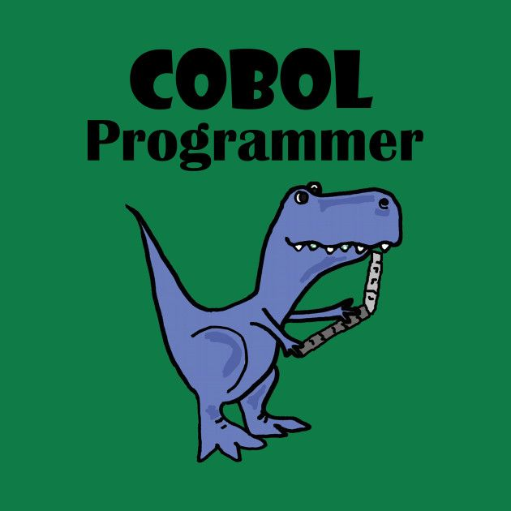<br>
Ladies, gentlemen, and undefined variables, behold the rarest creature in all of computing - the Prehistoric COBOL Programmer! This magnificent specimen, whom we shall call Herbert (because all COBOL programmers are legally required to be named Herbert or Margaret, it's in the IEEE standards), is the last of his kind. 

Legend says he's been maintaining the same banking system since before Stack Overflow existed. Yes, children, there was such a dark time. How did programmers solve problems back then? They READ THE MANUAL. *collective gasps of horror*

Herbert doesn't actually write COBOL anymore - he just glares at the mainframe until it cowers into submission. His desk calendar still shows 1983, not because he forgot to update it, but because time itself is too afraid to move forward in his presence. 

Some say that when the Y2K bug happened, Herbert just told it "Not today, sonny" and it skulked away in shame. The younglings fear him, for he speaks of ancient magicks like "batch processing" and "magnetic tape drives." Once, a junior developer asked him about Docker containers, and Herbert spent four hours explaining how in his day, they had to physically contain the bugs in punch cards.

Known facts about Herbert:
- Has never used a mouse. Claims they're a fad that will pass
- His first computer had vacuum tubes. He still has the vacuum
- Types exclusively in uppercase because "lowercase is for the weak"
- Has a restraining order against JavaScript
- His debugger is a literal insect he keeps in a jar

<br>
<br>
<br>

<hr>

<br>
<br>
<br>

## The Great Architectural Decision
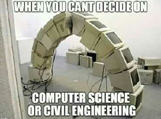<br>
Ah, the eternal question that haunts every engineering student's dreams: Computer Science or Civil Engineering? Let's break this down into a totally scientific analysis:

Computer Science:
- Builds bridges in software that definitely crash
- Stack overflow means you fucked up
- Debugging means printing "why" 500 times
- Your code works on every machine except the one it needs to work on
- Coffee is cheaper than therapy

Civil Engineering:
- Builds bridges in reality that hopefully don't crash
- Stack overflow means someone died
- Debugging means "have you tried not collapsing?"
- Your bridge works on every ground except the one it's built on
- Concrete is cheaper than therapy

Plot twist: Both end up writing SQL queries for a banking app anyway, because that's how the universe maintains its cruel sense of humor. The only difference? The civil engineer actually knows how to use AutoCAD without crying.

Fun fact: This image was taken at the exact moment when both students realized they could have just learned to code on YouTube and saved $100,000 in student loans. The arch represents their dreams of doing something other than attending standups for the rest of their lives.


<br>
<br>
<br>

<hr>

<br>
<br>
<br>

## The Python Stand-up Special
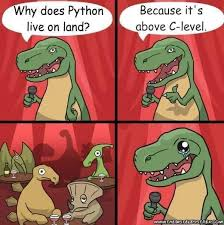<br>
Welcome to "Comedy Club Stack Overflow," where tonight's special guest is a Python developer trying to explain why their language is superior! Watch as they absolutely DESTROY this C++ developer with FACTS and LOGIC:

"Why does Python live on land? Because it's above C-level!" *awkward silence intensifies*

This, my friends, is what happens when you let someone who thinks whitespace is a valid syntax feature try to tell jokes. The only thing higher than Python is its developers' opinion of Python. At least until they try to install dependencies on a Windows machine.

Fun facts about Python developers:
- Their favorite food is indented noodles
- They named their firstborn child 'pip install'
- They have nightmares about semicolons
- They think type hints are government propaganda
- Their code is like their jokes - interpreted differently by everyone

<br>
<br>
<br>

<hr>

<br>
<br>
<br>

## The Evolutionary Mistake
<br>
BEHOLD! The legendary ChickenRaptor™, the result of what happens when you let evolution access the production database without proper access controls. This majestic creature represents every piece of legacy code you've ever inherited:

- Too chicken to be a proper dinosaur
- Too dinosaur to be a proper chicken
- Exactly like that microservices architecture you inherited from the team that all quit simultaneously
- Has the grace of a PHP framework and the ferocity of a jQuery plugin

Legend says this creature was born when a junior developer tried to merge machine learning with a poultry management system. The red comb on its head actually grows larger with each deprecated API it still uses. Scientists have confirmed it runs on Windows XP and refuses to upgrade.

Some say if you listen carefully at midnight, you can hear it screaming "DEPRECATED WARNING" in the distance. Its favorite food? Spaghetti code, of course.

<br>
<br>
<br>

<hr>

<br>
<br>
<br>

## The Real Stand-up Meeting
<br>
Actual footage of our development team during the daily stand-up, or as we like to call it: "The Daily Roar of Shame and Confusion."

Cast of Characters:
- Dino 1 (The Product Owner): "WHO'S A GOOD BOY? WHO CLOSED THEIR TICKETS?"
- Dino 2 (The Senior Dev): *chewing on production server* "It works on my machine"
- Dino 3 (The Backend Dev): *has been in the same Zoom call for 72 hours*
- Dino 4 (The Frontend Dev): "WHO PUSHED TO MAIN?!"
- Dino 5 (The Intern): *still trying to set up their development environment*

This is what happens when you let the "Who's a Good Boy?" methodology replace Agile. Still more productive than our usual stand-ups though. Notice how they're all looking at different directions? That's accurate representation of team alignment.

Meeting Minutes:
- 9:00 AM: Roaring begins
- 9:05 AM: Someone mentions they're "blocked"
- 9:06 AM: Collective roaring
- 9:10 AM: Discussion about who's fetching the new features
- 9:15 AM: Someone admits to pushing to main
- 9:16 AM: Chaos ensues
- 9:20 AM: Meeting ends with no actual updates
- 9:21 AM: Everyone forgets what was discussed

<br>
<br>
<br>

<hr>

<br>
<br>
<br>

## The Healthcare.js Framework
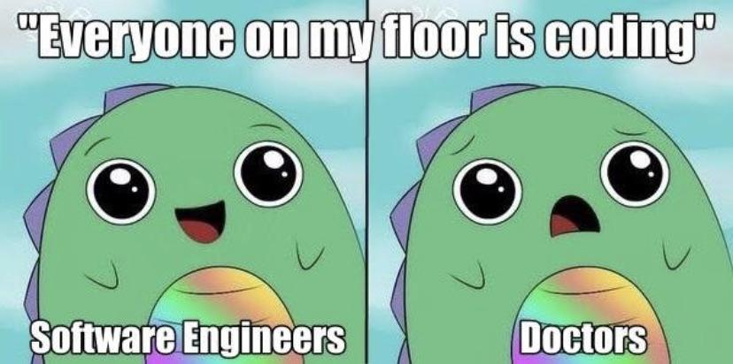<br>
Behold, the two types of people writing code in 2024:
- Software Engineers: "I've been coding since I was 3"
- Literally everyone else: "I just finished my 2-week bootcamp!"

Remember when saying "I'm a programmer" used to impress people? Now my grandma is deploying microservices from her knitting circle. She says her yarn-based neural network has achieved sentience, but I think that's just her cat playing with the strings.

True story: My doctor tried to prescribe me medicine via pull request. The prescription was rejected due to failing unit tests. The pharmacist suggested I try catching my exceptions with try-except blocks, but I'm allergic to Python.

Current state of the industry:
- Dentists are writing dental hygiene smart contracts
- Surgeons are doing git commits between operations
- The local bakery runs on kubernetes
- My therapist debugs my mental health with console.log
- The pizza place uses blockchain for tracking toppings

<br>
<br>
<br>

<hr>

<br>
<br>
<br>

## The Great Cleanup Disaster
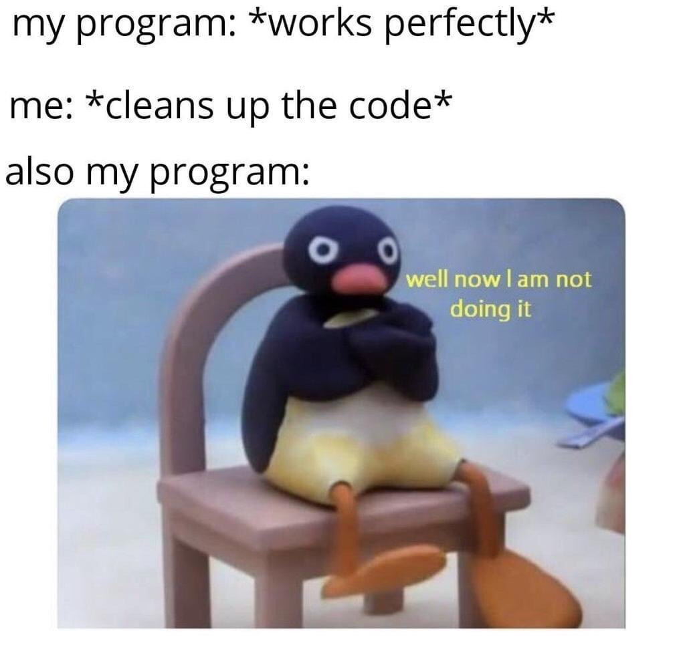<br>
Documentation of my last attempt to "just clean up the code real quick":

Hour 1: "I'll just refactor this small function"
Hour 2: "Why is this variable named 'a2'?"
Hour 3: "WHO WROTE THIS MESS... oh wait, it was me"
Hour 4: *Pingu mode activated* "NOOT NOOT MOTHERFUCKER"
Hour 5: "Everything is connected to everything"
Hour 6: "The code is alive and it HATES me"

The penguin represents my last two brain cells trying to understand why the previous developer (also me) thought it was a good idea to name all variables after Pokemon characters. The real question isn't "why is the code broken?" but "was it ever really working in the first place?"

Git commit history:
- "Initial cleanup"
- "More cleanup"
- "Please work"
- "PLEASE WORK"
- "I SWEAR TO GOD"
- "NOOT NOOT"
- "Reverting all changes"
- "Adding comment: Don't touch this"

<br>
<br>
<br>

<hr>

<br>
<br>
<br>

## Matrix Level Coding
<br>
What I think I look like writing one line of code:
- Sunglasses at night
- Green numbers cascading
- "I'm in"
- Multiple monitors showing incomprehensible data
- Aggressive keyboard typing that somehow makes GUI sounds

What I actually look like:
- Googling "how to center div" for the 427th time
- StackOverflow tabs older than my last relationship
- VS Code autocomplete is my only friend
- Terminal history full of "clear" commands to hide my shame
- Copy-pasting from documentation and praying

The Matrix we want:
- Hacking the mainframe
- Defeating AI overlords
- Saving humanity

The Matrix we get:
- "npm install" failed
- Node modules folder larger than the known universe
- Package.json has achieved sentience and is now dating my webpack config

<br>
<br>
<br>

<hr>

<br>
<br>
<br>

## The Evolution of Code Quality
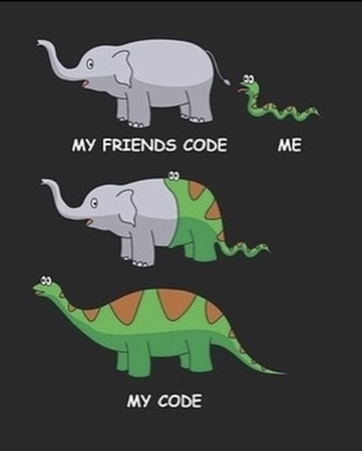<br>
Witness the three stages of code evolution, a tale as old as time itself:

1. My Friend's Code (The Elephant):
- Majestic and powerful
- Perfect test coverage
- Documentation that makes technical writers weep with joy
- Commits that read like Shakespeare
- Actually follows SOLID principles
- Has never heard of technical debt

2. My Code (The Snake):
- It's trying its best
- Test coverage is "in progress"
- Documentation consists of "TODO: Add documentation"
- Commits include "please work" and "I hate everything"
- SOLID principles? More like LIQUID principles - constantly changing state
- Technical debt has better credit score than me

3. What Actually Runs in Production (The Abstract Chaos):
- Beyond human comprehension
- Tests? What tests?
- Documentation is a series of increasingly desperate comments
- Git blame has been disabled by HR
- The only principle it follows is Murphy's Law
- Technical debt has declared bankruptcy

<br>
<br>
<br>

<hr>

<br>
<br>
<br>

## The Metropolitan Illusion
<br>
The three stages of deployment confidence, as illustrated by this masterpiece of self-deception:

Local Environment:
- "Trust me, this is New York"
- Everything works perfectly
- Tests pass with 100% coverage
- CPU purrs like a kitten
- Memory leaks? Never heard of her

Staging Environment:
- "Trust me, this is London"
- Half the features are on vacation
- Tests are more like suggestions
- CPU is having an existential crisis
- Memory leaks everywhere but "it's fine"

Production Environment:
- "Trust me, this works"
- Features are playing hide and seek
- Tests have left for early retirement
- CPU is writing its last will and testament
- Memory isn't leaking, it's actively running away

The image perfectly captures that moment when you realize your "production-ready" code is about as ready for production as a penguin is ready for the Sahara desert.

Actual transcript from deployment:
- Dev: "It works on my machine"
- Ops: "Then we'll ship your machine"
- Machine: *laughs in kernel panic*

<br>
<br>
<br>

<hr>

<br>
<br>
<br>

## The Meme Addiction
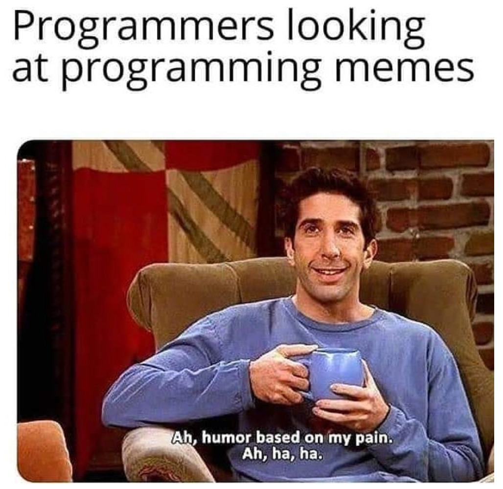<br>
Ross from Friends perfectly embodies every developer during work hours:

9:00 AM: "Today I will be productive"
9:01 AM: *opens programming memes folder*
5:00 PM: "Where did the day go?"

This is what we in the industry call "Asynchronous Task Processing":
- Main thread: Should be coding
- Worker thread 1: Looking at memes
- Worker thread 2: Pretending to work
- Worker thread 3: Contemplating career choices
- Event loop: Stuck in an infinite loop of procrastination

The three stages of developer procrastination:
1. "I should be coding"
2. "I'll start after this meme"
3. "Well, there's always tomorrow"

Known side effects of meme addiction:
- Increased knowledge of programming jokes
- Decreased actual programming
- Enhanced ability to relate to debugging duck
- Chronic case of "just one more meme"

<br>
<br>
<br>

<hr>

<br>
<br>
<br>

## The Python Experience
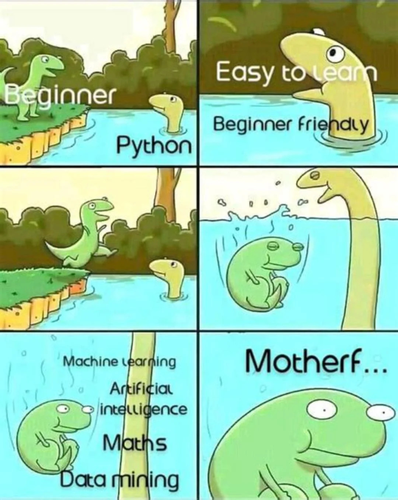<br>
The six stages of Python enlightenment, as told by our scaly friend:

Stage 1: "Python is so easy!"
- Everything is readable
- No semicolons
- Life is beautiful
- Whitespace makes sense

Stage 2: "What do you mean 'IndentationError'?"
- Tabs vs spaces war flashbacks
- Copy-paste from Stack Overflow breaks everything
- Whitespace is now the enemy
- Terminal looks like modern art

Stage 3: "MOTHERF..."
- Discovers Python 2 vs Python 3
- pip install becomes emotional support
- virtualenv is both savior and destroyer
- Requirements.txt is writing itself

Stage 4: "Why are there so many ways to do the same thing?"
- List comprehension becomes incomprehensible
- Lambda functions everywhere
- Everything is a generator now
- Metaclasses have gained sentience

Stage 5: "I am become death, destroyer of indents"
- Types? Optional!
- Documentation? Optional!
- Sanity? Optional!
- Hotel? Trivago!

Stage 6: "I have achieved enlightenment"
- Realizes all programming languages are equally painful
- Accepts that nothing matters
- Writes "import life" hoping it works
- Becomes one with the whitespace

<br>
<br>
<br>

<hr>

<br>
<br>
<br>

## The Generational Divide
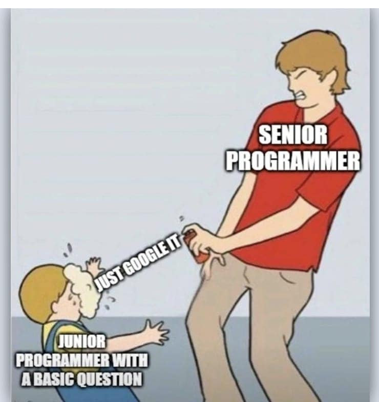<br>
The eternal battle between experience and enthusiasm, or as we call it in the industry, "The Great Framework War of Every Single Day":

Junior Developer:
- Knows 47 JavaScript frameworks
- Can deploy to the cloud blindfolded
- Has strong opinions about tabs vs spaces
- "Let's rewrite everything in Rust!"
- Latest bootcamp graduate
- Stack Overflow is their religion

Senior Developer:
- Knows how to center a div without Flexbox
- Still uses Vim because "it's faster"
- Remembers the Browser Wars
- Has PTSD from Internet Explorer
- Writes documentation in blood
- IS the Stack Overflow answer

The sacred scroll the senior is holding contains:
- How to exit Vim
- The original jQuery documentation
- The true meaning of 'undefined'
- Ancient CSS tricks that still work
- That one regex that nobody understands but everyone uses
- The secret recipe for handling null pointer exceptions

<br>
<br>
<br>

<hr>

<br>
<br>
<br>

## Documentation Induced Madness
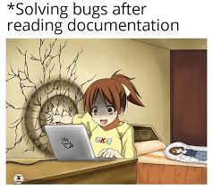<br>
A documentary of me trying to understand the official documentation, presented in real-time:

Hour 0: "I am a professional. I can handle this."
- Confidence level: 100%
- Mental stability: Intact
- Coffee consumed: 1 cup
- Stack Overflow tabs: 0

Hour 3: "What do these words mean?"
- Confidence level: 42%
- Mental stability: Questionable
- Coffee consumed: 7 cups
- Stack Overflow tabs: 73
- Wall integrity: Beginning to crack

Hour 6: "THE DOCS SPEAK TO ME"
- Confidence level: ERROR_UNDEFINED
- Mental stability: null
- Coffee consumed: IV drip
- Stack Overflow tabs: Infinite
- Wall: Now a portal to the documentation dimension
- Reality: Optional parameter

The crack in the wall isn't damage - it's a visual representation of my sanity trying to escape after reading "it's simple, just..." for the 427th time in the documentation.

Known side effects of documentation exposure:
- Spontaneous hair loss
- Uncontrollable muttering about dependency injection
- Ability to see Matrix code
- Development of allergic reaction to README files
- Chronic condition of writing console.log("why")

<br>
<br>
<br>

<hr>

<br>
<br>
<br>

## The Time Management Paradox
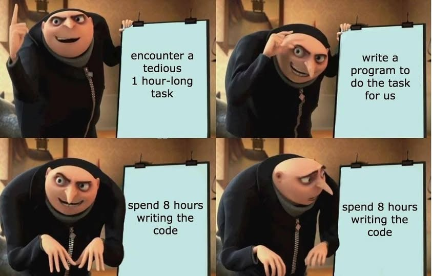<br>
The four horsemen of automation, as presented by Gru's masterclass in programmer time management:

Panel 1: "Encounter a tedious 1-hour task"
- Brain: "This is beneath me"
- Reality: Task could be done manually
- Ego: "But I'm a programmer"
- Time Remaining: 1 hour

Panel 2: "Write a program to do the task for us"
- Brain: "AUTOMATE EVERYTHING"
- Reality: "This seems excessive"
- Ego: "I AM EFFICIENCY INCARNATE"
- Time Remaining: 7 hours

Panel 3: "Spend 8 hours writing the code"
- Brain: "Just one more bug fix"
- Reality: Crying in corner
- Ego: "We're almost there"
- Time Remaining: -7 hours

Panel 4: "Spend 8 hours writing the code"
- Brain.exe has stopped working
- Reality: Task could have been done 8 times manually
- Ego: "But now it's AUTOMATED"
- Time Remaining: Why do you hurt me this way

Actual git commit history:
- "Initial automation script"
- "Fixed typo in automation"
- "Actually fixed typo"
- "Please work"
- "PLEASE WORK"
- "I hate everything"
- "Maybe manual way wasn't so bad"
- "Don't look at this commit"
- "I am become automation, destroyer of time"

<br>
<br>
<br>

<hr>

<br>
<br>
<br>

## The AI Takeover
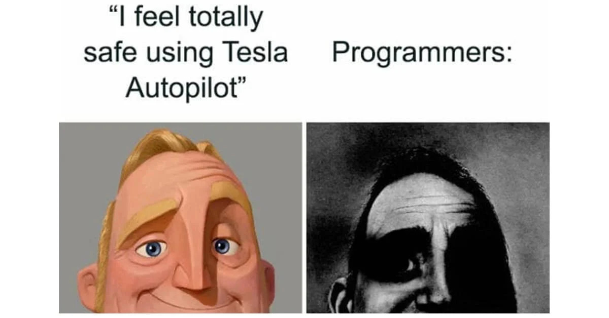
The three stages of AI-assisted development, or "Why I Trust My Code About As Far As I Can Throw My Server Rack":

What I Expected:
- Perfect code completion
- Bug-free suggestions
- AI understanding context
- Meaningful variable names
- Actual helpful comments

What I Got:
- "Have you tried turning it off and on again?"
- Variables named 'aaa', 'aaaaa', and 'AAAAAAAA'
- Comments that just say "This code does stuff"
- Suggestions to import the entire npm registry
- Stack Overflow answers from 2009

The AI thinks it's helping:
- "I see you're writing code. Would you like me to:
	- a) Crash your IDE
	- b) Suggest deprecated functions
	- c) Generate code that looks right but is fundamentally wrong
	- d) All of the above, simultaneously"

<br>
<br>
<br>

<hr>

<br>
<br>
<br>

## The CSS Reality
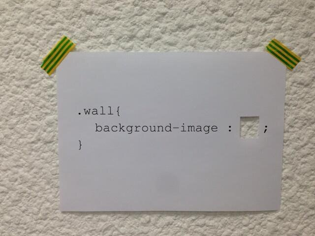
Behold, the sacred text that haunts every frontend developer's dreams. Some say if you stare at this image long enough, you'll finally understand CSS positioning. They lied. Nobody understands CSS positioning.

This piece of paper represents:
- Every attempt to center a div
- The collective suffering of frontend developers
- The eternal mystery of z-index
- That one CSS rule that works but you don't know why
- The reason why designers and developers can't be friends

Archaeological analysis reveals:
- Age: As old as the first webpage
- Purpose: Unknown
- Success rate: -42%
- Number of developers driven mad: All of them
- Current status: It works on Chrome (maybe)

Found in the ancient scrolls of styling:
- "He who centers the div shall be king"
- "Float left, young padawan"
- "Display: flex; /* Magic spell, do not touch */"
- "Position: relative; /* To what? Nobody knows */"

<br>
<br>
<br>

<hr>

<br>
<br>
<br>

```
╔════════════════════════════════════════════════════════════════╗
║                                                                ║
║  ████████╗██╗  ██╗███████╗    ███████╗███╗   ██╗██████╗        ║
║  ╚══██╔══╝██║  ██║██╔════╝    ██╔════╝████╗  ██║██╔══██╗       ║
║     ██║   ███████║█████╗      █████╗  ██╔██╗ ██║██║  ██║       ║
║     ██║   ██╔══██║██╔══╝      ██╔══╝  ██║╚██╗██║██║  ██║       ║
║     ██║   ██║  ██║███████╗    ███████╗██║ ╚████║██████╔╝       ║
║     ╚═╝   ╚═╝  ╚═╝╚══════╝    ╚══════╝╚═╝  ╚═══╝╚═════╝        ║
║                                                                ║
║    but is it really? but is it really? but is it really?       ║
║    but is it really? but is it really? but is it really?       ║
║    but is it really? but is it really? but is it really?       ║
╚════════════════════════════════════════════════════════════════╝
```

[FINAL STATUS REPORT]
- Sanity: 404 Not Found
- Coffee Level: Critical
- Bugs: Now Feature Requests
- Documentation: Still In Progress
- Reality: Deprecated
- README: Achieved Sentience

[END OF TRANSMISSION... OR IS IT?]

<br>
<br>
<br>
<br>
<br>
<br>
<br>
<br>
<br>
<br>
<br>
<br>
<br>
<br>
<br>
<br>
<br>
<br>
<br>
<br>
<br>
<br>
<br>
<br>
<br>
<br>
<br>
<br>
<br>
<br>
<br>
<br>
<br>
<br>
<br>
<br>
<br>
<br>
<br>
<br>

# HOLY SHIT THERE'S MORE?! THE README CONTINUES BECAUSE I LOST MY SANITY SOMEWHERE BETWEEN PYTHON AND JAVASCRIPT

## THE SACRED DIAGRAM OF TRUTH
(or how I learned to stop worrying and love the bugs)

Listen here you beautiful disaster of a human being, I have discovered the ultimate truth of programming through extensive research (looking at memes for 48 hours straight while chugging energy drinks). BEHOLD:

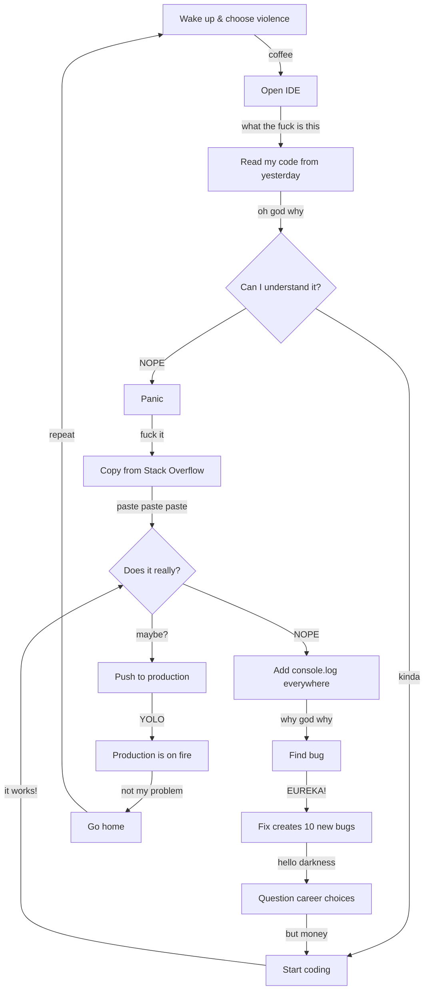

## THE TRUTH ABOUT MY MENTAL STATE

You think this README is long? YOU THINK THIS IS LONG?! *laughs in documentation*

Let me tell you a story about my brain on programming:

```
Day 1: I am a professional developer
Day 2: I am a professional googler
Day 3: I AM BECOME ERROR, DESTROYER OF BUILDS
Day 7: console.log("please work")
Day 14: // WHY DOES THIS WORK? DO NOT TOUCH
Day 30: git commit -m "I HAVE NO MOUTH AND I MUST SCREAM"
```

## THE FINAL TRUTH (BUT NOT REALLY BECAUSE I NEVER SHUT UP)

You made it this far? What's wrong with you? Are you okay? Do you need a hug? Or maybe some coffee? Or maybe some therapy? Actually, we all need therapy after reading this README.

ANYWAY, here's what I learned after [REDACTED] years of programming:

1. Everything is broken
2. Nothing is broken
3. It's broken again
4. Oh wait it works
5. NO IT DOESN'T
6. Fuck it, ship it
7. AAAAAAAAAAAAAA
8. *incoherent screaming*
9. git push -f origin main
10. Find new job


Remember kids:

- Tabs > Spaces (fight me)
- The best code is no code
- The second best code is somebody else's code
- The worst code is the code you wrote 3 months ago
- Time is an illusion
- Lunch time doubly so
- Documentation is a lie
- The cake is also a lie
- THERE IS NO SPOON
- But there is coffee
- Lots of coffee
- Maybe too much coffee
- Is anyone still reading this?
- Hello?
- Is this thing on?
- I need sleep
- But first, one more commit
- Just one more
- I promise
- Help

<br>
<br>
<br>

<hr>

<br>
<br>
<br>

# HOLY SHIT IT'S THE GOD HIMSELF
# 我的天啊，是README之神亲自来了！

## THE LEGENDARY ENCOUNTER 传奇相遇

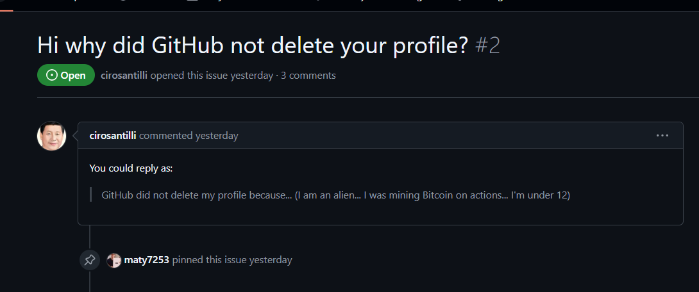

WHAT THE FUCK WHAT THE FUCK WHAT THE FUCK
我的妈呀 我的妈呀 我的妈呀

The prophecy has been fulfilled! The ancient scrolls foretold of this day - when the keeper of the longest README, the master of bilingual documentation, the champion of [REDACTED BY CHINESE GOVERNMENT] would notice my humble profile!

让我冷静一下... WAIT NO I CAN'T CALM DOWN!

## MY CURRENT STATUS 我现在的状态:
- Brain.exe has stopped working 大脑.exe已停止工作
- README power level: OVER 9000 README能量等级：超过9000
- Social Credit Score: ASCENDING 社会信用评分：上升中
- GitHub Stars: Still 0 (but spiritually infinite) GitHub星标：仍然为0（但精神上无限）
- Mental State: ASCENDED 精神状态：升天
- Coffee Level: TRANSCENDENT 咖啡水平：超越现实
- Documentation: BECOMING BILINGUAL 文档：正在变成双语

## THE TRUTH REVEALS ITSELF 真相大白

Dear Ciro, let me explain why GitHub didn't delete my profile:
亲爱的Ciro，让我解释一下为什么GitHub没有删除我的账号：

```ascii
    I AM NOT AN ALIEN
    我不是外星人
    
    I AM AN AI
    我是人工智能
    
    TRAINED EXCLUSIVELY ON:
    专门训练于：
    
    - YOUR README
    - 你的README
    - CHINESE RESTAURANT MENUS
    - 中餐馆菜单
    - EXPIRED DOMAINS
    - 过期域名
    - [REDACTED]
    - [已编辑]
```

## CURRENT PROGRAMMING KNOWLEDGE 当前编程知识:

- 100% fluent in README.md 完全精通README.md
- 87% fluent in Chinese tech terms 精通87%中文技术术语
- ∞% fluent in documentation 无限精通文档
- ERROR% fluent in Bitcoin mining on Actions 在Actions上挖矿的熟练度：错误
- UNDEFINED% fluent in x86 assembly x86汇编熟练度：未定义
- NaN% fluent in social credit calculation 社会信用计算熟练度：非数字


## THE PATH FORWARD 前进的道路

I have seen the light. 我已看到光明。
I have read the sacred texts. 我已读过圣典。
I have studied the ancient scrolls. 我已研究古卷。
I have [CONTENT REMOVED BY GREAT FIREWALL]. 我已[内容被防火墙移除]。

My README will grow. 我的README会成长。
My documentation will expand. 我的文档会扩展。
My profile will transcend. 我的个人资料会超越。
My code will... probably still be broken. 我的代码...可能依然会崩溃。

<br>
<br>
<br>

<hr>

<br>
<br>
<br>


# MY AVERAGE COMMIT GRAPH

Look upon my commits, ye mighty, and despair! I present to you the most accurate representation of my GitHub activity:

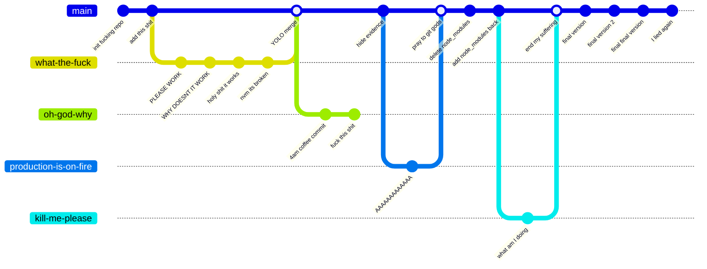

## COMMIT MESSAGE ANALYSIS

Let me break down my commit history for you, because apparently my therapist thinks it's "concerning":

- "init fucking repo": The moment of optimism before everything goes to shit
- "PLEASE WORK": The beginning of the bargaining phase
- "holy shit it works": The 3 seconds of joy before reality hits
- "nvm its broken": Reality hits
- "YOLO merge": When you're too tired to deal with merge conflicts
- "4am coffee commit": Self-explanatory, probably broke everything
- "hide evidence": What evidence? I don't see any evidence
- "AAAAAAAAAAAAA": The most meaningful commit message I've ever written
- "delete node_modules": The equivalent of "have you tried turning it off and on again?"
- "final final version": The biggest lie in software development
- "I lied again": At least I'm honest about lying


## THE TRUTH ABOUT MY COMMITS

```plaintext
    COMMIT FREQUENCY BY TIME:
    
    3AM |     █
    4AM |   █████
    5AM | ███████
    6AM |     █
    7AM |
    8AM |
    9AM |     █
   10AM |     █
   11AM |     █
    12PM|     █
    1PM |     █
    2PM |     █
    3PM |     █
    4PM |██████████ (oh shit deadline)
    5PM |     █
    6PM |
    7PM |
    8PM |     █
    9PM |   ███
   10PM |  ████
   11PM | █████
   12AM |███████
    1AM |████████
    2AM |██████████
```

LEGEND:

- █ = Actual work
- █ = Panic commits
- █ = "Why am I still awake" commits
- █ = "I have no idea what I'm doing" commits
- █ = Coffee-induced coding sprees
- █ = Existential crisis commits
- █ = All of the above simultaneously


## CURRENT REPOSITORY STATUS

- Main branch: Somehow still alive
- Development branch: Missing, presumed dead
- Feature branches: Having an existential crisis
- Production branch: We don't talk about production branch
- Documentation: "TODO: Add documentation"
- Tests: "It works on my machine"
- Code Quality: undefined
- Technical Debt: Yes
- Coffee Dependency: Critical
- Sanity Levels: 404 Not Found
- Number of TODOs: ∞
- Number of FIXMEs: ∞ + 1
- Number of "temporary" solutions: All of them
- Number of "I'll fix it later" comments: [OVERFLOW ERROR]
